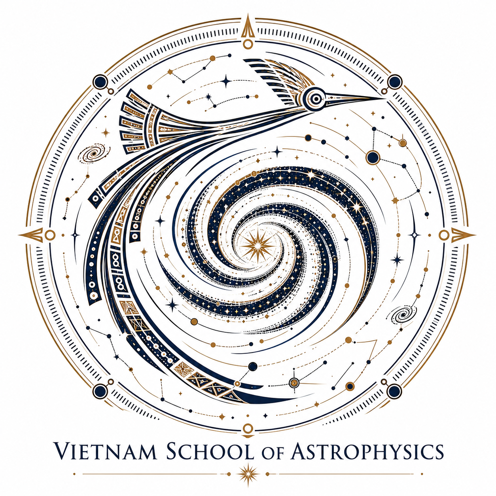
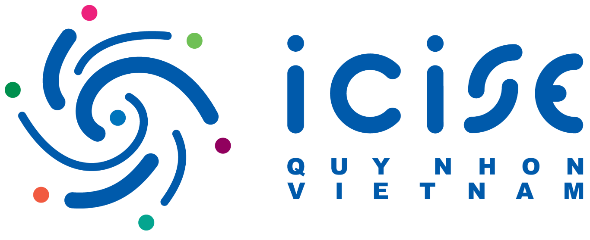

# VSOA10
Lecture notes and hands-on session materials at [VSOA10: Cosmology](https://www.icisequynhon.com/conferences/2026/VSOA10/index.html) at [ICISE](https://www.icisequynhon.com/conferences/2026/VSOA10/icise.html), Qui Nhon, Vietnam in July 2026.

The five-day program can be found [here](https://www.icisequynhon.com/conferences/2026/VSOA10/program.html), which includes four block of lectures on Theoretical Cosmology, Large-scale Structure, Galaxy Surveys and Machine Learning, presented by four [researchers](https://www.icisequynhon.com/conferences/2026/VSOA10/lecturers.html) from Kavli IPMU. The full list of participants can be found [here](https://www.icisequynhon.com/conferences/2026/VSOA10/participants.html).

  
  &nbsp;&nbsp;&nbsp;
  

